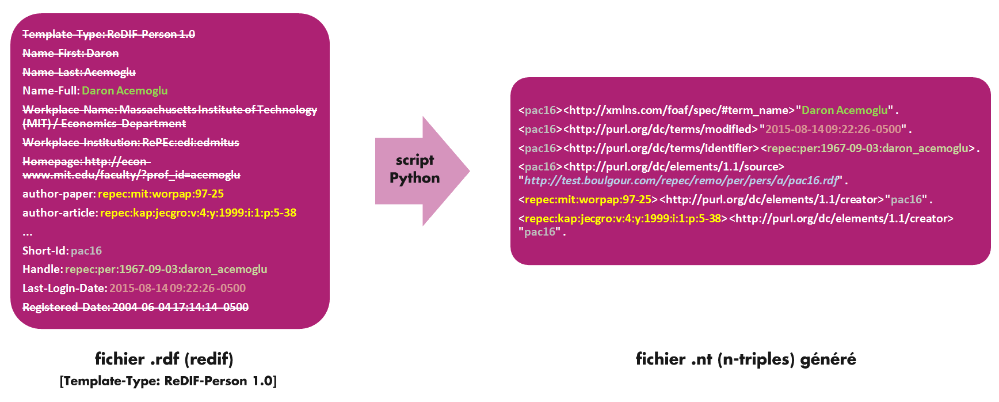
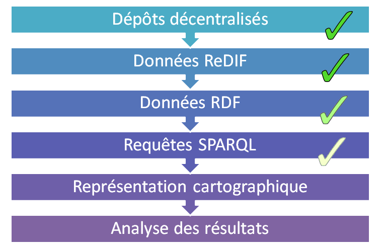

% Vers un service RePEc d'analyse de réseaux de co-auteurs
% Bruno BEAUFILS; Nahid OULMI; Yann SECQ; Christophe WILLAERT;
% 09 mai 2016

# Contexte et objectifs du projet

## Analyser un réseau de co-auteurs

- Contexte
    - recherche d'«*informaticiens*» par Étienne FARVAQUE
    - récupération de *photos* de la *base de données* [RePEc](http://repec.org)
    - projet M2 [Réseaux Sociaux et Numériques](http://rsn.link)
- Objectif : **étudier les réseaux de co-auteurs en Sciences Économiques**
- Étapes
	1. comprendre le fonctionnement de RePEC
	2. construire une base de données du réseau d'auteurs en sciences économiques
	3. pouvoir interroger cette source de données
	4. rendre *largement* accessible cette source de données
	5. développer des visualisations *pertinentes*

## RePEc : Research Papers in Economics {.allowframebreaks}

- Système créé en 1997 pour diffuser les recherches en sciences économiques

- Base de données bibliographique **décentralisée**

    - très volumineuses : plus de 2 000 000 items différents recensés
    - **méta-données** (*notices*) : working papers, articles, livre, chapitre de livres, logiciels
    - **données** : texte complet (souvent PDF), logiciels

- Principes de base

    1. **l'*éditeur* contrôle complètement ce qu'il diffuse** (*archive*)
        - indexation, hébergement et mise à disposition publique des informations
        - respect de conventions 

    2. **les données sont publiques**

    3. **une autorité très légère** (nommage des noeuds)
        - attribue un code d'archive à chaque membre
        - publie une archive contenant la liste des membres

- Pas de contrôle unique et pas de moyens
	- certains services importants hébergés par la *Federal Reserve Bank of St. Louis*
	- groupe de volontaires (*bénévoles*)

## RePEc : conventions

- **structuration des dossiers**
    -  [protocole de Guilford](https://ideas.repec.org/p/rpc/rdfdoc/guildp.html)

- **format des méta-données**
    -  [**ReDIF** (*Research Document Information Format*)](https://ideas.repec.org/p/rpc/rdfdoc/redif.html)
    - fichier texte simple
        - plusieurs enregistrement séparés par des lignes vides
        - chaque enregistrement comporte plusieurs lignes
        - 1 ligne = clé + valeur
    - plusieurs types de méta-données gérés (`Template-Type`)
        - `ReDIF-Archive` pour les archives
        - `ReDIF-Series` pour les séries d'une archive
        - `ReDIF-Paper` pour les *working paper*
        - `ReDIF-Article` pour les articles de revues/journaux
        - `ReDIF-Book` pour les livres
        - `ReDIF-Chapter` pour les chapitres de livres
        - `ReDIF-Software` pour les logiciels

- **mise à dispostion**
    - site ftp ou http anonyme

## Méta-données: exemple de fichier ReDIF (article)

\smaller[2]

```
Template-type: ReDIF-Paper 1.0
Title: How committees reduce the volatility of policy rates
Author-Name: Etienne Farvaque
Author-Name: Norimichi Matsueda
Author-Name: Pierre-Guillaume Méon
Author-Person: pmo274
Publication-Status: Published by: DULBEA - Université libre de Bruxelles, Bruxelles
Creation-Date: 2007-07
Length: 42 p.
Series: Working papers DULBEA
Number: 07-11.RS
Language: en
Classification-JEL: D70; E43; E58; F33
Keywords: Monetary Policy Committees; Decision Procedures; Interest-rate; Monetary Union
Abstract: This paper relates the volatility of interest rates to the
  collective nature of monetary policymaking in monetary unions. Several
  decision rules are modelled, including hegemonic and democratic procedures,
  and also committees headed by a chairman. A ranking of decision rules in
  terms of the volatility of policy rates is obtained, showing that the
  presence of a chairman has a cooling e¤ect. However, members of a monetary
  union are better off under symmetric rules (voting, consensus, bargaining),
  unless they themselves chair the union. The results are robust to the
  inclusion of heterogeneities among members of the monetary union.
File-URL: https://dipot.ulb.ac.be/dspace/bitstream/2013/8422/1/pgm-0035.pdf
File-Format: application/pdf
File-Function: pgm-0035
Handle: RePEc:dul:wpaper:07-11rs
```

## Méta-données: exemple de fichier ReDIF (archive)

\smaller[2]

**remo/all/gatarch.rdf**

```
Template-type: ReDIF-Archive 1.0
Handle: RePEc:gat
Name: Groupe d'Analyse et de Th#orie Economique (GATE), Centre national de la recherche scientifique (CNRS), Universit# Lyon 2, Ecole Normale Sup#
Maintainer-Email: wirth@gate.cnrs.fr
Description: This archive collects working papers from the Groupe d'Analyse et de Th#orie Economique (GATE) 
URL: ftp://ftp.gate.cnrs.fr/RePEc/gat/
```

**remo/all/gatseri.rdf**

```
Template-type: ReDIF-Series 1.0
Name: Working Papers
Provider-Name: Groupe d'Analyse et de Th#orie Economique (GATE), Centre national de la recherche scientifique (CNRS), Universit# Lyon 2, Ecole Nor
Provider-Homepage: http://www.gate.cnrs.fr/
Provider-Institution: RePEc:edi:gateefr
Maintainer-Name: Nelly Wirth
Maintainer-Email: wirth@gate.cnrs.fr
Type: ReDIF-Paper
Handle: RePEc:gat:wpaper
```

## RePEC : une galaxie de services

- accès web à la base bibliographique pure
    - [IDEAS](http://ideas.repec.org)
    - [EconPapers](http://econpapers.repec.org)

- veille/annonce de nouvelles publications
    - [NEP](http://nep.repec.org) (New Economics Papers)
    - liste les nouveautés apparus dans RePEc
    - définit une classification des domaines

- annuaire des institutions
    - [EDIRC](http://edirc.repec.org) (Economics Departments, Institutes and Research Centers in the World)

. . .

- service de gestion des auteurs
    - [RePEc Author Service](authors.repec.org)
    - identification des auteurs
        - chaque auteur a un identifiant unique
        - désambiguation manuelle
    - lien auteur / données dans RePEc
    - publication d'une archive spécifique `per`

## authors : un exemple `pga226`

\smaller[3]

- **remo/per/pers/g/pga226.rdf**

```
Template-Type: ReDIF-Person 1.0
Name-First: Frederic
Name-Middle: J.
Name-Last: Gannon
Name-Full: Frederic John Gannon
Workplace-Name: Université du Havre
/ Départment AES/Économie
Workplace-Institution: RePEc:edi:dehavfr
author-article: repec:eee:indorg:v:24:y:2006:i:3:p:629-637
author-article: repec:cai:reofsp:reof_122_0367
author-paper: repec:hal:journl:halshs-00084891
author-paper: repec:hal:journl:halshs-00366895
author-article: repec:cai:reofsp:reof_122_0333
author-paper: repec:hal:wpaper:halshs-00353816
author-paper: repec:hal:journl:halshs-00155313
author-paper: repec:spo:wpmain:info:hdl:2441/4422
author-paper: repec:hal:journl:halshs-00155319
author-paper: repec:hal:journl:halshs-00085184
author-paper: repec:hal:journl:halshs-00085181
author-paper: repec:cor:louvrp:1261
author-paper: repec:hal:journl:halshs-00085182
author-paper: repec:hal:journl:halshs-00084896
author-paper: repec:hal:journl:halshs-00369724
author-paper: repec:hal:wpaper:hal-00972774
Short-Id: pga226
Handle: repec:per:1962-05-27:frederic_john_gannon
Last-Login-Date: 2015-12-06 11:41:13 -0600
Registered-Date: 2006-06-09 18:04:09 -0400
```

# De RePEC à l'analyse de réseaux de co-auteurs

## L'accès aux métadonnées

- Accès à l'ensemble des données de RePEc via des accès FTP/HTTP
    - `repec.org` liste tous les sites (*archives*)
    - miroir de l'ensemble des sites mis en place
	    - accessible sur [`http://dev.repec.fr`](http://dev.repec.fr)
        - 23 % de sites en erreur pour l'instant
        - sous-estimation à cause de site pas erreur mais vide
        - photo instantanée (*snapshot*) de l'ensemble de la base à plusieurs moments
- Parcours de l'ensemble des publications ?
    - un répertoire du mirroir : `remo/per`
    - contient un fichier ReDIF par auteur présent dans RePEc :)
    - chaque fichier contient les informations sur un auteur
        - son nom
        - la liste des documents auxquels il a contribué
- **Quel choix de représentation de cette source de données** ?

## Une méta-donnée préparée par `authors`

\smaller[3]

- **remo/per/pers/f/pfa122.rdf**

```
Template-Type: ReDIF-Person 1.0
Name-First: Etienne
Name-Last: Farvaque
Name-Full: Etienne Farvaque
Workplace-Name: Université de Lille Nord-de-France
/ Laboratoire Économie Quantitative, Interaction, Politiques Publiques et Économétrie (EQUIPPE)
Workplace-Institution: RePEc:edi:eqlilfr
Workplace-Share: 75
Workplace-Name: SKEMA Business School
Workplace-Institution: RePEc:edi:esclifr
Workplace-Share: 15
Workplace-Name: Université du Havre
/ Départment AES/Économie
Workplace-Institution: RePEc:edi:dehavfr
Workplace-Share: 10
Email: etienne.farvaque@univ-lille1.fr
Homepage: https://sites.google.com/site/etiennefarvaque/
Postal:  Université Lille1 Sciences et Technologies
 59655 Villeneuve d'Ascq Cedex
 France
author-article: repec:eee:ecolet:v:77:y:2002:i:1:p:131-135
author-paper: repec:dul:wpaper:07-11rs
[...]
author-paper: repec:nbp:nbpmis:221
author-article: repec:cai:repdal:redp_251_0097
Short-Id: pfa122
Handle: repec:per:2006-06-14:etienne_farvaque
Last-Login-Date: 2015-11-18 04:20:51 -0600
Registered-Date: 2006-06-14 03:29:17 -0400
author-paper: repec:pra:mprapa:13076
```

## Interrogation et accès à la source de données

- **ad hoc**: BDD orientée graphes avec langage ad hoc de parcours
    - +: chemin le plus court pour un développeur
    - -: inexploitable par un non informaticien
- **relationelle**: approche classique avec un modèle relationnel
    - +: gestion de sources volumineuses de données structurées
    - -: si on ajoute des informations, nécessité de restructurer la base
    - -: nécessité de connaître SQL pour effectuer des requêtes
- **sémantique**: représenter l'ensemble des informations sous une forme moins structurée (ie. des triplets)
    - +: pas de modèle a priori (enfin presque, cf. ontologies)
    - +: peut être enrichi au fur et à mesure des nouveaux besoins
    - +: faciliter d'ouverture d'accès à la source de données (*SPARQL endpoint*)
    - -: nécessité de connaître SPARQL (bien plus complexe que SQL!)

## Qu'est-ce qu'une base de données sémantique ?

- Web sémantique
    - un projet des fondateurs du web depuis les années 90
    - porté par le [W3C](http://w3c.org)
    - appellé aussi **web des données** (*Linked Data*)
- Idée
    - rendre l'information manipulables par les machines
    - lier l’information avec des données structurées
    - faire du web une bibliothèque géante unifiée
	- **mettre en relation des objets**
- Exemple
    - DBPedia est la version sémantique de Wikipedia

## DBPedia : exemple

\smaller[1]

- **Villes de plus de 100.000 habitants en Ile-de-France**

```
prefix db-owl: <http://dbpedia.org/ontology/>
 select * where {
   ?ville db-owl:region <http://fr.dbpedia.org/resource/Île-de-France> . 
   ?ville rdf:type db-owl:Settlement .
   ?ville db-owl:populationTotal ?population .
   FILTER (?population > 100000)
 }
```

- **Livres dont l'auteur est Danielle Steel et le titre en anglais lorsqu'il est disponible**

```
PREFIX dbo: <http://dbpedia.org/ontology/>
PREFIX res:  <http://dbpedia.org/resource/>
PREFIX rdf: <http://www.w3.org/1999/02/22-rdf-syntax-ns#>
PREFIX rdfs: <http://www.w3.org/2000/01/rdf-schema#>
SELECT DISTINCT ?uri ?string 
WHERE {
	?uri rdf:type dbo:Book .
    ?uri dbo:author res:Danielle_Steel .
	OPTIONAL { ?uri rdfs:label ?string . 
	  FILTER (lang(?string) = 'en') }
}
```

## RDF : Resource Description Framework

- modèle de données pour publier/interroger des données sur le web
- RDF est constitué 
    - un modèle reposant sur la notion de triplet
    - un triplet = un *sujet* + un *prédicat* + une *ressource* 
    - un modèle reposant sur les logiques de description (OWL)
    - plusieurs syntaxes de représentations: RDF/XML, Turtle, N-Triples ...
- **But: convertir les notices ReDiF en triplets RDF**


## RDF et la syntaxe N-triples

- Modèle RDF = **(Sujet – Prédicat – Objet)**
- Syntaxe *N-Triple* correspondant à cet exemple : 

        <Sujet> <Prédicat> <Objet> .

    - *Ne pas oublier le point !*
- Le sujet et l’objet peuvent être
    - une `URI` ou `URL` (mieux)
    - un littéral (c-à-d une chaîne de caractères quelconque)
- Le prédicat doit obligatoirement être un `URI` ou une `URL`


# Des notices ReDIF aux triplets RDF


## Parseur de fichiers ReDIF => RDF

- *Parser* un fichier = le parcourir et en extraire les informations utiles

- Informations pertinentes à extraire pour l'ensemble des auteurs: 
    - Noms
    - Prénoms
    - Domaine d’activité
    - Ensemble des documents auxquels aura participé l’auteur 

- Parser implémenté sous la forme d'un script python travaillant sur le miroir local de l'ensemble des ressources RePEC
- 58 700 fichiers ReDIF à traiter


## Organiser l’information sous forme de triplets

- Triplet = **(Sujet – Prédicat – Objet)**
- Défini un graphe de ressources liées par des relations binaires
 



## Enrichir ces données

- Nom/Prénom
- Identifiant unique (URL ?)
- Dernière connexion
- Problème de la classification NEP/JEL

## Enrichir ces données


# Accessibilité et interrogation de la source de données


## Test de Virtuoso

- Virtuoso est un *triplestore*
    - Base conçue pour les données RDF ... mais pas seulement
    - Complet ... mais complexe
    - Installé sur le serveur `dev.repec.fr`
- Objectifs :
    - Importer nos N-Triples dans la base
    - Effectuer des requêtes SPARQL

## Utilisation de Virtuoso

- Accès : 
    - web via l’outil Conductor
        - interface graphique depuis un navigateur
    - en ligne de commande via iSQL
        - commande `isql-vt`
- Syntaxe : 
    - langage SQL intégré
    - langage SPARQL

## SPARQL

- Langage de requêtes pour des données RDF
    - Equivalent au SQL mais pour le web sémantique
    - Standardisé par le W3C depuis 2008
- Permet de sélectionner 
    - le nœuds d’un graphe RDF
    - ainsi que les liens qui les composent

## SPARQL : un exemple

Les coauteurs de `pfa122` (Étienne FARVAQUE)

\small

    SELECT DISTINCT "pfa122" ?auteur
    WHERE
    {
        ?publication ?p ?auteur .
        FILTER
		(
		  ?publication =
		  (
		    SELECT ?publication
		    WHERE
			{
			  ?publication <http://purl.org/dc/elements/1.1/creator> "pfa122"
		    }
	      )
          && ?auteur != "pfa122"
        )
    };


# Conclusion et perspectives

## Point d'étape à l'issue du projet de M2


## Perspectives : **démarrer la *production***

**Outil**

- Valider le mirroir RePEc
- Automatiser la création des triplets RDF
- Construire un moteur non-interactif simple de requête SPARQL
- Offrir une API (REST) d'interrogation
    - 3 critères de recherche : nom, profondeur, domaine (JEL)
    - Filtre de résultat : date de dernière mise à jour des méta-données

**Données**

- Validation des données obtenues
    - présence code JEL
    - présence date de modification
    - durée de présence de la données
- Construction des requêtes SPARQL
- Enrichissement des données

**Long terme**

- visualisations des réseaux (d3.js ?)
- extension à d'autres sources (DBLP)
