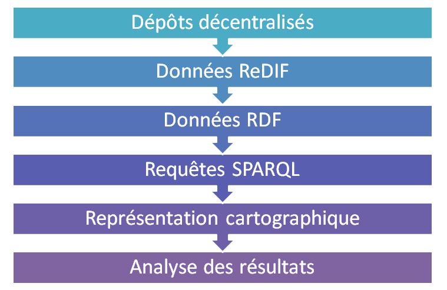

% Vers un service RePeC d'analyse de réseaux de co-auteurs
% Christophe WILLAERT; Nahid OULMI; Bruno BEAUFILS; Yann SECQ
% 09 mai 2016

# Contexte et objectifs du projet

## Analyser un réseau de co-auteurs

- Contexte : projet de S2 du M2 Réseaux Sociaux et Numériques
- Objectifs : **étudier les réseaux de co-auteurs en Sciences-Économiques**
    - auteurs des publications présentes dans RePEc
    - exemples de questionnement :
        - *un auteur avec un h-index élevé est-il bien central dans la discipline ?*
        - *dans son champ d’études ?*
- Principales étapes du projet
	- comprendre le modèle de RePeC (*Research Papers in Economy*)
	- construire une source de données des chercheurs en économie
	- pouvoir interroger cette source de données
	- rendre (largement) accessible cette source de données
	- *développer des visualisations pertinentes*

## RePeC: Research Papers in Economy

- Création en 1997 de cette base décentralisée de notices
- Repose sur un simple dépôt FTP: chacun peut créer son noeud
- Centralisation au niveau du nommage unique de chaque noeud
- Différents services proposés aux chercheurs
- Base assez volumineuse contenant environ 2 000 000 d'items
    - \+ de 58 700 auteurs
    - \+ de 1 220 000 articles (publiés) 
    - \+ de 709 000 papiers (*working papers*)
    - \+ de 37 000 chapitres de livre
- Notice bibliographiques exprimées sous la forme de fichiers texte sous forme de méta-données en format **ReDIF** (*Research Document Information Format*)

## Méta-données: exemple de fichier ReDiF

    Template-Type: ReDIF-Paper 1.0
    Author-Name:  David Currie
    Author-Name:  Paul Levine
    Author-Email:  p.l.levine@surrey.ac.uk
    Author-Name:  Joeseph Pearlman
    Author-Name:  Michael Chui
    Title:  Phases of Imitation and Innovation in a North-South
      Endogenous Growth  Model
    Abstract:  In this paper, we develop a North-South endogenous growth
      model to examine three phases of development in the South: imitation
      (...)
      growth make the subsidizing of Southern education by the North
      particularly attractive.
    Length:  26 pages
    Creation-Date:  1996-07
    File-URL: ftp://ftp.surrey.ac.uk/pub/econ/WorkingPapers/surrec9602.ps
    File-Format: Application/postscript
    Handle: RePEc:sur:surrec:9602

# De RePeC à l'analyse de réseaux de co-auteurs

## L'accès aux métadonnées

- Accès à l'ensemble des données de RePEc via des accès FTP/HTTP
    - `repec.org` liste tous les sites (*archives*)
    - miroir de l'ensemble des sites mis en place pour le projet
    - accessible sur `http://test.boulgour.com/repec`
- Parcours de l'ensemble des publications ?
    - un répertoire du mirroir : `remo/per`
    - contient un fichier ReDIF par auteur présent dans RePEc :)
    - chaque fichier contient les informations sur un auteur
        - son nom
        - la liste des documents auxquels il a contribué
- **Quel choix de représentation de cette source de données** ?

## Interrogation et accès à la source de données

- **ad'hoc**: BDD orientée graphes avec langage ad'hoc de parcours
    - +: chemin le plus court pour un développeur
    - -: inexploitable par un non informaticien
- **relationelle**: approche classique avec un modèle relationnel
    - +: gestion de sources volumineuses de données structurées
    - -: si on ajoute des informations, nécessité de restructurer la base
    - -: nécessité de connaître SQL pour effectuer des requêtes
- **sémantique**: représenter l'ensemble des informations sous une forme moins structurée (ie. des triplets)
    - +: pas de modèle a priori (enfin presque, cf. ontologies)
    - +: peut être enrichi au fur et à mesure des nouveaux besoins
    - +: faciliter d'ouverture d'accès à la source de données (*SPARQL endpoint*)
    - -: nécessité de connaître SPARQL (bien plus complexe que SQL!)

## Qu'est-ce qu'une base de données sémantique ?

- Web sémantique
    - un projet des fondateurs du web depuis les années 90
    - porté par le [W3C](http://w3c.org)
- Idée
    - rendre l'information manipulables par les machines
    - lier l’information avec des données structurées
    - faire du web une bibliothèque géante unifiée
- Appellé aussi **web des données** (*Linked Data*)
- Exemple: DBPedia est la version sémantique de Wikipedia

## Exemple: DBPedia (1)

    prefix db-owl: <http://dbpedia.org/ontology/>
     select * where {
       ?ville db-owl:region <http://fr.dbpedia.org/resource/Île-de-France> . 
       ?ville rdf:type db-owl:Settlement .
       ?ville db-owl:populationTotal ?population .
       FILTER (?population > 100000)
     }
     
- **Villes de plus de 100.000 habitants en Ile-de-France**

## Exemple: DBPedia (2)

    PREFIX dbo: <http://dbpedia.org/ontology/>
    PREFIX res:  <http://dbpedia.org/resource/>
    PREFIX rdf: <http://www.w3.org/1999/02/22-rdf-syntax-ns#>
    PREFIX rdfs: <http://www.w3.org/2000/01/rdf-schema#>
    SELECT DISTINCT ?uri ?string 
    WHERE {
    	?uri rdf:type dbo:Book .
        ?uri dbo:author res:Danielle_Steel .
    	OPTIONAL { ?uri rdfs:label ?string . 
    	  FILTER (lang(?string) = 'en') }
    }

- **Livres dont l'auteur est Danielle Steel et le titre en anglais lorsqu'il est disponible**

## RDF : Resource Description Framework

- modèle de données pour publier/interroger des données sur le web
- RDF est constitué 
    - un modèle reposant sur la notion de triplet
    - un triplet = un *sujet* + un *prédicat* + une *ressource* 
    - un modèle reposant sur les logiques de description (OWL)
    - plusieurs syntaxes de représentations: RDF/XML, Turtle, N-Triples ...
- **But: convertir les notices ReDiF en triplets RDF**

## URI : l'identifiant des objets sur le web

- **Comment identifier de manière unique une ressource ?**
- `Uniform Ressource Identifier` (`URI`)
    - un identifiant unique pour une source web
    - composant important du web sémantique
- `Uniform Ressource Locator` (`URL`)
    - identifie une source et permet **en plus** d’y accéder directement
- `URI` ne permet pas tant de retrouver la source que de la qualifier

## RDF et la syntaxe N-triples

- Modèle RDF = **(Sujet – Prédicat – Objet)**
- Syntaxe *N-Triple* correspondant à cet exemple : 

        <Sujet> <Prédicat> <Objet> .

    - *Ne pas oublier le point !*
- Le sujet et l’objet peuvent être
    - une `URI` ou `URL` (mieux)
    - un littéral (c-à-d une chaîne de caractères quelconque)
- Le prédicat doit obligatoirement être un `URI` ou une `URL`

# Des notices ReDiF aux triplets RDF

## Parseur de fichiers ReDIF => RDF

- *Parser* un fichier = le parcourir et en extraire les informations utiles

- Informations pertinentes à extraire pour l'ensemble des auteurs: 
    - Noms
    - Prénoms
    - Domaine d’activité
    - Ensemble des documents auxquels aura participé l’auteur 

- Parser implémenté sous la forme d'un script python travaillant sur le miroir local de l'ensemble des ressources RePeC
- 58 700 fichiers ReDIF à traiter

## Organiser l’information sous forme de triplets

- Triplet = **(Sujet – Prédicat – Objet)**
- Défini un graphe de ressources liées par des relations binaires
 

## Enrichir ces données

- Nom/Prénom
- Identifiant unique (URL ?)
- Dernière connexion
- Problème de la classification NEP/JEL

## Enrichir ces données

# Accessibilité et interrogation de la source de données

## Deux types de bases potentielles

- Bases de données sémantiques (*triplestores*)
    - logique pure / approche académique
    - (hautement) complexe
    - met l'accent sur le raisonnement
        - notion d'inférences
        - notion d'ontologies
    - met l'accent sur la précision (le plus complet possible)
 
- Bases de données orientées graphes
    - langage ad'hoc d'interrogation du graphe
    - complexité intermédiaire (pour un programmeur !)
    - plus performant

## Choix de Virtuoso

- Virtuoso est un *triplestore*
    - Base conçue pour les données RDF ... mais pas seulement
    - Complet ... mais complexe
    - Installé sur le serveur `test.boulgour.com`
- Objectifs :
    - Importer nos N-Triples dans la base
    - Effectuer des requêtes SPARQL

## Utilisation de Virtuoso

- Accès : 
    - web via l’outil Conductor
        - interface graphique depuis un navigateur
    - en ligne de commande via iSQL
        - commande `isql-vt`
- Syntaxe : 
    - langage SQL intégré
    - langage SPARQL

## SPARQL

- Langage de requêtes pour des données RDF
    - Equivalent au SQL mais pour le web sémantique
    - Standardisé par le W3C depuis 2008
- Permet de sélectionner 
    - le nœuds d’un graphe RDF
    - ainsi que les liens qui les composent

## SPARQL : un exemple

Les coauteurs de `pfa122` (Étienne FARVAQUE)

\small

    SELECT DISTINCT "pfa122" ?auteur
    WHERE
    {
        ?publication ?p ?auteur .
        FILTER
		(
		  ?publication =
		  (
		    SELECT ?publication
		    WHERE
			{
			  ?publication <http://purl.org/dc/elements/1.1/creator> "pfa122"
		    }
	      )
          && ?auteur != "pfa122"
        )
    };

# Conclusion et perspectives

## Point d'étape à l'issue du projet

## Perspectives

- Enrichissement des données, ex. JEL/NEP (ReDiF => RDF)
- Création d'une API REST encapsulant des requêtes SPARQL
- Visualisations des réseaux (d3.js ?)
- extension à d'autres sources (DBLP, citeseer ?)

