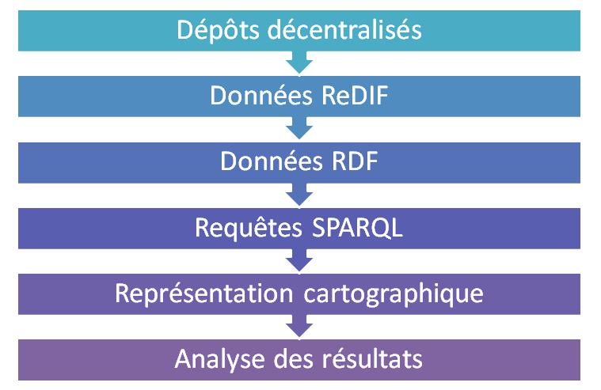
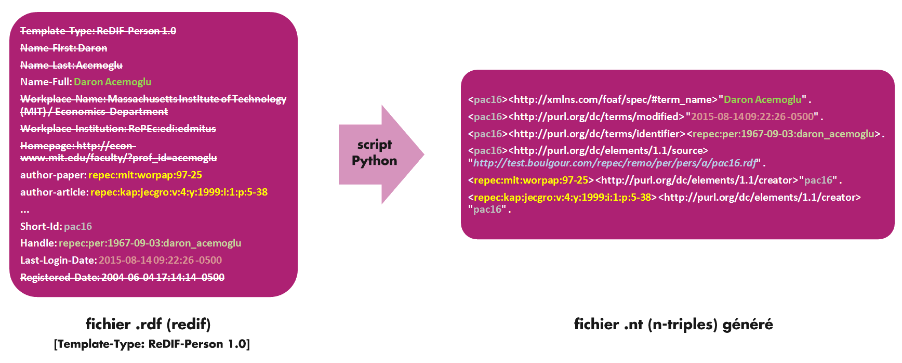
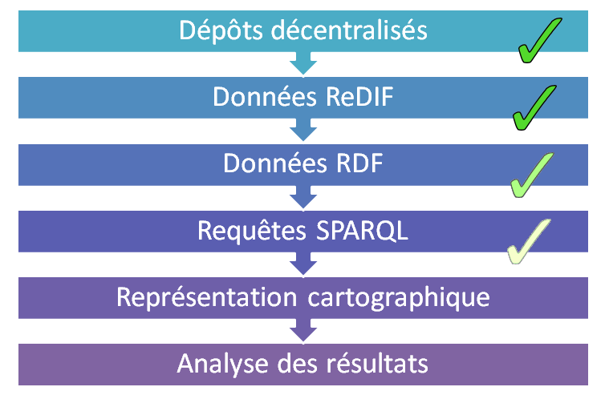

% Projet RePEc
% Christophe WILLAERT; Nahid OULMI
% 25 février 2016

# Introduction

## Research Papers in Economic

- Crée en 1997
- Base de données décentralisée 
- 2 000 000 items recensés :
    - + de 58 700 auteurs
    - + de 1 220 000 articles (publiés) 
    - + de 709 000 papiers (working papers)
    - + de 37 000 chapitres de livre
- Métadonnées au format **ReDIF** (*Research Document Information Format*)

## Le projet

- Objectif : *étudier les réseaux de co-auteurs en Sciences-Économiques*
    - Auteurs des publications présentes dans RePEc
    - Ex: un auteur avec un h-index élevé est-il bien central dans la discipline et dans son champ d’études?
- Mission :
    - nous approprier les jeux de données
    - nous approprier les notions liées au web sémantique
    - concevoir un script pour la conversion des données
    - mettre les données converties en base de données

## Les étapes

## L'accès aux métadonnées

- Accès à l'ensemble des données de RePEc via des accès FTP/HTTP
    - `repec.org` liste tous les sites (*archives*)
    - miroir de l'ensemble des sites mis en place pour le projet
    - accessible sur `http://test.boulgour.com/repec`
- Une archive particulière
    - un répertoire du mirroir : `remo/per`
    - contient un fichier ReDIF par auteur présent dans RePEc
    - chaque fichier contient les informations sur un auteur
        - nom
        - liste des documents auxquels il a contribué
- C’est à partir de ces fichiers que nous avons travaillé

## Base de données sémantiques ?

- Web sémantique
    - un projet des fondateurs du web depuis les années 90
    - porté par le [W3C](http://w3c.org)
- Idée
    - rendre l'information accessible aux machines
    - lier l’information avec des données structurées
    - faire du web une bibliothèque géante unifiée
- On parle désormais de **web des données** (*Linked Data*)

# Éléments du web sémantique

## RDF : Resource Description Framework

- un cadre de travail pour publier/manipuler des donnés sur le web
- recouvre à la fois 
    - un modèle liant un *sujet* à un *objet* via un *verbe*
    - notion de triplets RDF (plus petit élément de connaissance)
    - plusieurs syntaxes de représentations
        - RDF/XML,
        - Turtle,
        - N-Triples
        - ...
- Contexte
    - récupérer les données des fichiers ReDIF
    - pour les mettre sous la forme de triplets RDF
    - afin de pouvoir analyser les relations entre auteurs
    - choix de la syntaxe N-Triples pour sa simplicité

## URI : l'identifiant des objets sur le web

- Uniform Ressource Identifier (URI)
    - un identifiant unique pour une source web
    - composant important du web sémantique
- Uniform Ressource Locator (URL)
    - identifie une source et permet **en plus** d’y accéder directement
- URI ne permet pas tant de retrouver la source que de la qualifier

## La syntaxe N-triples

- La structure du RDF est une séquence **(Sujet – Prédicat – Objet)**
- Utilisation de la syntaxe N-Triple pour produire cette séquence : 

        <Sujet> <Prédicat> <Objet> .

    - *Ne pas oublier le point !*
- Le sujet et l’objet peuvent être
    - une URI
    - une URL (mieux)
    - un littéral (c’est-à-dire une chaîne de caractères non-identifiée)
- Le prédicat doit obligatoirement être un URI ou une URL

# Produire les triplets RDF

## Créer un parseur de fichiers ReDIF

- *Parser* un fichier = le parcourir et en extraire les informations utiles

- Objectif dans notre cas : 
    - Noms
    - Prénoms
    - Domaine d’activité
    - Ensemble des documents auxquels aura participé l’auteur 

- Pour l’ensemble des auteurs enregistrés

## Notre parseur en Python

 - Trois étapes :
	1. Ranger les données dans des listes
	2. Concaténer ces listes pour avoir des N-Triples
	3. Lui faire comprendre qu'on lui fournit des fichiers en entrée

## Prendre des fichiers en argument

- Plus de 58 700 fichiers ReDIF à traiter
    - automatisation de la tâche nécessaire
- **Bash** : langage de programmation des systèmes Unix
- Avec Bash et Python nous pouvons prendre en argument une infinité de fichiers

## Organiser l’information sous forme de N-Triples

- Souvenez-vous des N-Triples : **(Sujet – Prédicat – Objet)**
- Exemple dans notre cas :
- 

## Enrichir ces données

- Nom/Prénom
- Identifiant unique (URL ?)
- Dernière connexion
- Problème de la classification NEP/JEL

## Enrichir ces données

# Rendre les données accessibles

## Deux types de bases de données

- Bases de données sémantiques (*triplestores*)
    - logique pure / approche académique
    - hautement complexe
    - met l'accent sur le raisonnement
        - notion d'inférences
        - notion d'ontologies
    - met l'accent sur la précision (le plus complet possible)
 
- Bases de données orientées graphes
    - pragmatisme
    - complexité intermédiaire
    - faciliter pour traverser les graphes
    - plus performant

## Choix de Virtuoso

- Virtuoso est un *triplestore*
    - Base conçue pour les données RDF ... mais pas seulement
    - Complet ... mais complexe
    - Installé sur le serveur `test.boulgour.com`
- Objectifs :
    - Importer nos N-Triples dans la base
    - Effectuer des requêtes SPARQL

## Utilisation de Virtuoso

- Accès : 
    - web via l’outil Conductor
        - interface graphique depuis un navigateur
    - en ligne de commande via iSQL
        - commande `isql-vt`
- Syntaxe : 
    - langage SQL intégré
    - langage SPARQL

## SPARQL

- Langage de requêtes pour des données RDF
    - Equivalent au SQL mais pour le web sémantique
    - Standardisé par le W3C depuis 2008
- Permet de sélectionner 
    - le nœuds d’un graphe RDF
    - ainsi que les liens qui les composent

## SPARQL : un exemple

Les coauteurs de `pfa122` (Étienne FARVAQUE)

\small

    SELECT DISTINCT "pfa122" ?auteur
    WHERE
    {
        ?publication ?p ?auteur .
        FILTER
		(
		  ?publication =
		  (
		    SELECT ?publication
		    WHERE
			{
			  ?publication <http://purl.org/dc/elements/1.1/creator> "pfa122"
		    }
	      )
          && ?auteur != "pfa122"
        )
    };

# Conclusion

## Point d'étape à l'issue du semestre

## Étapes de travail restantes

- Etape facultative: création d'une API
- Etape de visualisation des données
- Enrichir l’information (JEL/NEP ?)

## Ce que nous avons appris

- Mise en pratique de notions vu en cours
    - Python
    - Linux / Bash
- Apprentissage et mise en pratique de notions nouvelles
    - Markdown
    - SSH
    - Git / Github
    - RDF / Virtuoso

## Difficultés rencontrées

- Compréhension des concepts liés au web sémantique
- Virtuoso:
    - difficulté de prise en main de Virtuoso
    - pas d'accès à l'interface en ligne de commande
    - pas de feeback lors de l'exécution des requêtes
- Classification JEL/NEP

## Remarques

- Regarder les alternatives à Virtuoso
- Vérifier l'intégrité des données en base
- Souhait de suivre/poursuivre le projet
